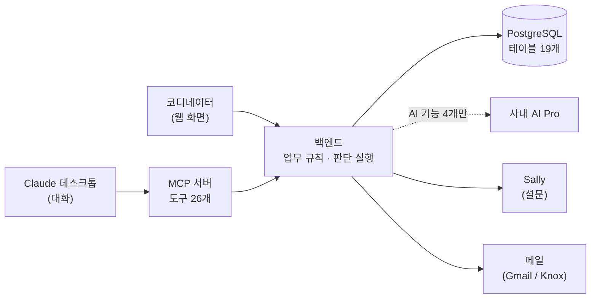
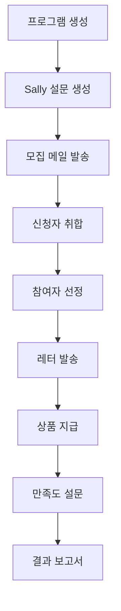
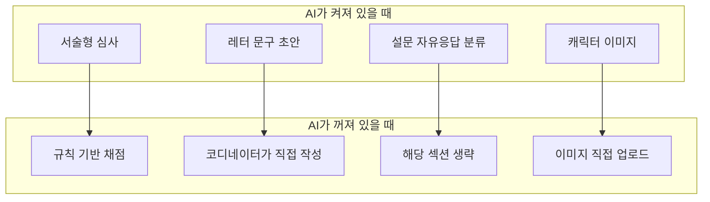
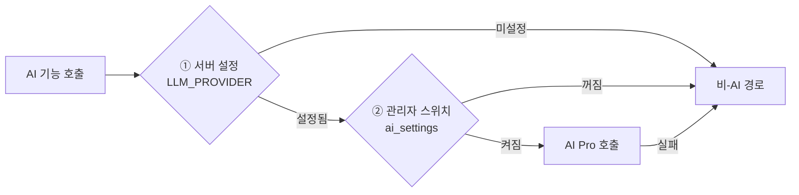
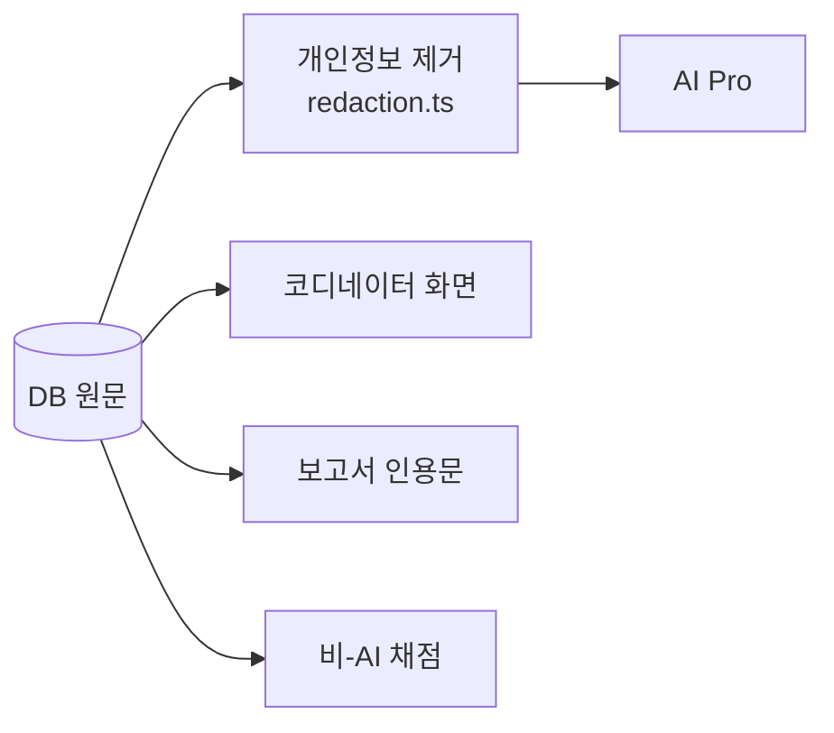
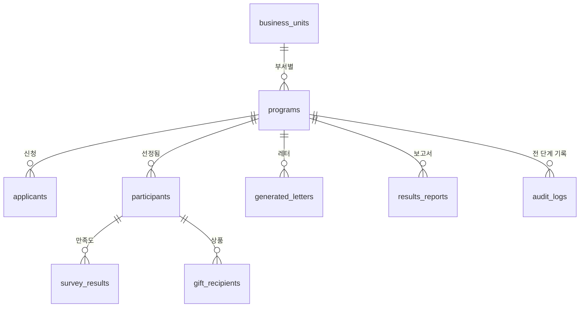
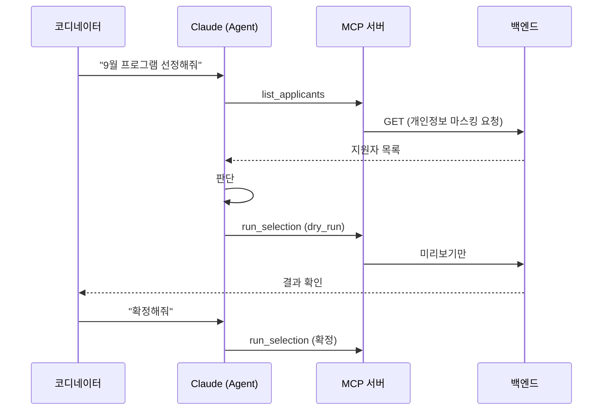

# 시스템 구조

프로그램/이벤트 운영 자동화 시스템이 **어떻게 만들어져 있는지**를 설명합니다.
AI를 모르셔도 읽을 수 있도록 썼습니다.

기준일 2026-08-02 · 코드 25,214줄 · 테스트 155개

---

## 0. 한 장 요약



읽는 법 — 화면이든 대화든 **모든 요청은 백엔드를 통과**합니다. 백엔드가 규칙을 적용하고
기록을 남깁니다. AI는 점선입니다. **없어도 시스템이 돌아갑니다.**

---

## 1. 세 덩어리로 되어 있습니다

| 덩어리 | 하는 일 | 규모 |
|---|---|---:|
| **backend** | 업무 규칙, 데이터, 외부 연동 | 14,473줄 / 84파일 |
| **frontend** | 코디네이터가 쓰는 화면 20개 | 9,603줄 / 55파일 |
| **mcp-server** | Claude가 이 앱을 조작하는 도구 26개 | 1,138줄 / 11파일 |

세 덩어리가 한 저장소 안에 있고(`npm workspaces`), 서로를 직접 호출하지 않습니다.
프론트엔드와 MCP 서버는 **둘 다 백엔드의 같은 API를 부릅니다.**

이게 중요한 이유: 화면으로 하든 Claude에게 시키든 **같은 규칙, 같은 검증, 같은 기록**을
거칩니다. 두 개의 진실이 생기지 않습니다.

---

## 2. 업무 흐름과 코드의 대응



| 단계 | 담당 코드 | AI |
|---|---|:---:|
| 프로그램 생성 | `routes/programs.ts` | — |
| 설문 생성 | `services/sallySurveyDraft.ts` + `services/sally.ts` | — |
| 배너 이미지 | `services/sallySurveyDescriptionImage.ts` | — |
| 모집 메일 | `services/recruitmentNotice.ts` | — |
| 신청자 취합 | `services/sallyImport.ts`, `services/applicantStaging.ts` | — |
| 참여자 선정 | `routes/selection.ts` | **일부** |
| 레터 | `routes/letters.ts` | **일부** |
| 상품 지급 | `routes/gifts.ts` | — |
| 결과 보고서 | `routes/reports.ts` | **일부** |
| 소요시간 측정 | `services/cycleMetrics.ts` | — |

**대부분의 칸이 비어 있습니다.** 시스템의 몸통은 AI가 아니라 일반 코드입니다.

---

## 3. AI가 들어간 곳은 네 군데뿐입니다



화살표는 **떨어지는 방향**입니다. AI가 없거나 실패하면 아래 칸으로 내려가고, **업무는 계속됩니다.**

| 기능 | AI가 하는 판단 | 코드 |
|---|---|---|
| 서술형 심사 | 지원 동기의 구체성·진정성을 0~100점 + 근거 문장 | `justificationScreening.ts` |
| 레터 문구 | 프로그램 맥락에 맞는 본문 초안 | `letterCopy.ts` |
| 설문 분류 | 응답을 긍정/개선 주제로 분류 | `surveyVoc.ts` |
| 캐릭터 이미지 | 마스코트 그림 생성 | `imageGeneration.ts` |

### 왜 AI를 안 쓴 곳이 더 많은가

**같은 입력에 같은 답이 나와야 하는 일**에는 AI를 쓰지 않았습니다.

- 날짜·장소·인원은 데이터에서 그대로 찍습니다. AI가 쓰면 틀릴 수 있고, 아무도 못 알아챕니다.
- 선착순·점수 선정은 계산입니다. 계산에 AI가 낄 이유가 없습니다.
- 레터와 배너의 **텍스트는 코드가 렌더링**합니다(Puppeteer). AI는 그림만 만듭니다.

---

## 4. AI를 켜고 끄는 이중 잠금



**둘 다 통과해야만** AI가 호출됩니다. 그리고 실패해도 아래로 떨어집니다.

- **① 서버 설정** — 운영자가 `.env`에서 정합니다. 부서가 AI를 못 쓰면 여기서 막힙니다.
- **② 관리자 스위치** — 화면에서 기능별로 켜고 끕니다. **기본값은 전부 꺼짐**입니다.

제공자가 없는데 스위치를 켜려 하면 **거부(409)**합니다. "설정은 켜졌는데 실제론 폴백이 도는"
어정쩡한 상태를 만들지 않기 위해서입니다.

---

## 5. AI에 무엇을 보내고 무엇을 보내지 않는가

사내 규정상 AI Pro에 **개인정보를 보내려면 승인이 필요**한데, 이 앱은 받을 수 없습니다.
그래서 **보내지 않는 것을 코드로 강제**했습니다.



**마스킹은 AI로 가는 사본에만** 적용됩니다. 화면·보고서·폴백은 원문 그대로입니다.

| | AI로 나가나 |
|---|:---:|
| 이름 | 나감 (조직이 취급을 허용하는 유일한 식별자) |
| 이메일 · 전화번호 · 사번 · 주민번호 | **제거됨** |
| 부서 | 안 보냄 |
| 지원서·설문 본문 | 위 항목을 제거한 뒤 보냄 |

사번은 **애초에 저장하지 않습니다**(마이그레이션 018에서 컬럼 제거).

---

## 6. 판단의 출처를 구분해 기록합니다

같은 "AI 점수"라도 **어디서 왔는지에 따라 보장 수준이 다릅니다.**

| 출처 | 뜻 | 화면 표시 |
|---|---|---|
| `ai` | 앱이 고정된 프롬프트로 호출. 편향 지침·마스킹·모델ID 기록됨 | 파란 배지 |
| `agent` | Claude가 MCP로 넣은 점수. 위 보장이 **없음** | **경고색 배지** |
| `heuristic` | 규칙 기반 계산 | 초록 배지 |

둘을 `ai`로 뭉뚱그리면 **감사 기록이 거짓말을 합니다.** 사람의 당락을 가르는 기능이라
구분해 남깁니다. 보고서에도 한 줄이 자동으로 들어갑니다.

---

## 7. 데이터

테이블 19개, 마이그레이션 21개. 핵심만 보면:



| 테이블 | 역할 |
|---|---|
| `programs` | 프로그램. 일시·장소·마감 등은 `intake_data`(JSON)에 |
| `applicants` → `participants` | 신청자 중 선정된 사람이 참가자가 됨 |
| `audit_logs` | **누가·언제·무엇을** 했는지 전 단계 기록 |
| `ai_settings` | AI 기능별 on/off (기본 전부 off) |
| `sally_sessions` | Sally 로그인 세션(암호화). **비밀번호는 저장 안 함** |
| `schema_migrations` | 적용된 마이그레이션 이력 |

**성과 측정이 `audit_logs`에서 파생됩니다.** 별도로 기록하지 않기 때문에 숫자를 만들 수 없습니다.

---

## 8. 외부 연동

| 대상 | 방식 | 왜 |
|---|---|---|
| **AI Pro** | HTTPS API | 앱이 호출할 수 있는 유일한 AI. 외부 AI는 사규상 불가 |
| **Sally** | 브라우저 자동화(Playwright) | **API가 없음.** 계정별 로그인만 가능 |
| **메일** | Gmail(임시) → Knox Portal | 제공자 교체식. 환경변수 한 줄로 전환 |
| **Confluence** | 사내 MCP 서버 | 우리가 만들지 않음. Agent가 보고서를 게시 |

Sally는 세션이 **계정당 하나**입니다. 앱이 로그인하면 코디네이터가 로그아웃되고, 반대도
마찬가지입니다. 화면에 미리 경고합니다.

---

## 9. Agent는 이 앱이 아닙니다



**Agent는 무엇을 언제 호출할지 판단하고, 코드는 그 행동을 정확하게 실행합니다.**

이 분리가 핵심입니다. 모델이 API를 직접 호출하면 무엇이 왜 실행됐는지 나중에 재현할 수
없습니다. 지금 구조에서는 모든 실행이 코드 경로와 감사로그에 남습니다.

되돌릴 수 없는 일(메일 발송)에는 **dry-run**이 걸려 있습니다. Agent는 준비까지만 하고,
발송은 사람이 확정합니다.

---

## 10. 검증

| 대상 | 테스트 |
|---|---:|
| 백엔드 | 128 |
| 프론트엔드 | 23 |
| MCP 서버 | 4 |
| **합계** | **155** |

테스트가 지키는 것은 커버리지 숫자가 아니라 **조용히 깨지면 위험한 성질**입니다.

- 개인정보가 AI로 나가지 않는가
- 설문 인용문이 원문과 바이트 단위로 같은가
- dry-run이 메일을 정말 안 보내는가
- `agent` 점수가 `ai`로 둔갑하지 않는가
- 존재하지 않는 날짜(2026-02-30)가 조용히 3월로 굴러가지 않는가

```bash
cd app && npm test --workspace backend
```

---

## 11. 설치

```bash
docker compose up --build      # Postgres + 앱
npm run migrate --workspace backend   # 마이그레이션 21개
npm run seed --workspace backend      # 사업부·레터 카테고리
```

빈 DB에서 시작해 화면이 뜨는 것까지 확인했습니다. 프로그램·신청자는 하나도 만들지 않으므로
새 팀이 남의 데이터로 시작하지 않습니다.
